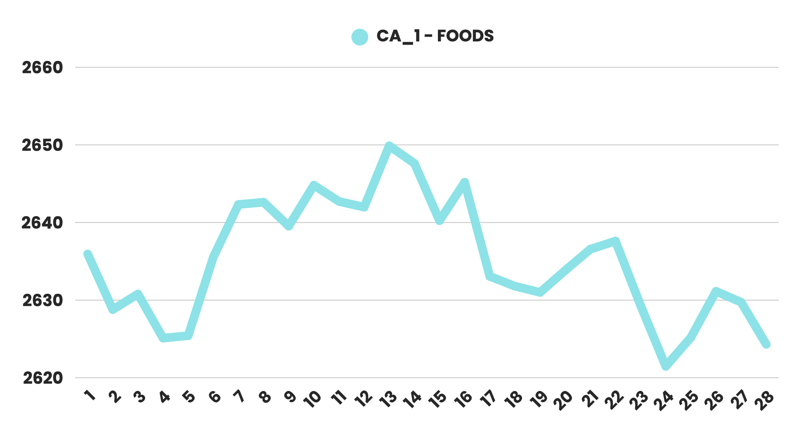
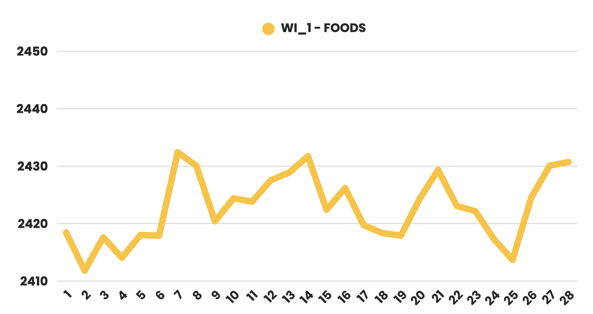

# Retail Sales Forecasting with LSTM

## Summary
Walmart drives over $1.27B in U.S. daily sales and serves 37M customers each day, highlighting the massive potential for impact through smarter inventory planning. By predicting next month's item-level sales, Walmart can better anticipate demand shifts, align inventory with promotions and seasonal trends, and reduce costly stockouts or overstocks.

This project applies predictive modeling techniques to tackle structured tabular features (calendar events, SNAP flags, prices) with sequential sales data at the store-item level. Ultimately protecting revenue and enhancing the customer experience.

## Approach
- Predictive Modeling, Data Engineering
- Model(s) applied: LSTM, LGBM, GRU
- Model selected as final approach: LSTM

## Result
#### LSTM as Forecasting Model
- Better captures the pattern of long-term sequential data
- Learns from past behavior and accommodate complex features such as promotion, holiday etc.
- Relatively better accuracy with RMSSE of 1.50406

#### Strategize Demand Planning
Walmart can allocate inventory based on forecast results (down to item-level sales forecasting). For example:
- High demand in week 2 for store CA_1
- High demand on weekends for store WI_1

#### Automation as Next Step
Developing an automated pipeline to import historical data and generate sales forecasts can enable Walmart to dynamically and efficiently adjust its inventory plans

## Artifacts
- Notebook: [LSTM_walmart_predict_sales.html](notebooks/LSTM_walmart_predict_sales.html)
- Report: [report.pdf](reports/report.pdf)

## Acknowledgement
Dataset/Competition: https://www.kaggle.com/c/m5-forecasting-accuracy  
This project was carried out in collaboration with the following authors:
- Chen Ju (Maggie) Wang
- Ya Chin (Ruth) Hsu
- Yi Hsiang (Royce) Yen
- Shang Chien (Shawn) Wang
